# Домашнее задание к занятию «Системы контроля версий» Тукаев Айрат
   
------

## Задание 1. Создать и настроить репозиторий для дальнейшей работы на курсе

В рамках курса вы будете писать скрипты и создавать конфигурации для различных систем, которые необходимо сохранять для будущего использования. 
Сначала надо создать и настроить локальный репозиторий, после чего добавить удалённый репозиторий на GitHub.

### Создание репозитория и первого коммита

1. Зарегистрируйте аккаунт на [https://github.com/](https://github.com/). Если предпочитаете другое хранилище для репозитория, можно использовать его.

2. Создайте публичный репозиторий, который будете использовать дальше на протяжении всего курса, желательное с названием `devops-netology`.
   Обязательно поставьте галочку `Initialize this repository with a README`. 
   
    
    
3. Создайте [авторизационный токен](https://docs.github.com/en/authentication/keeping-your-account-and-data-secure/creating-a-personal-access-token) для клонирования репозитория.
4. Склонируйте репозиторий, используя протокол HTTPS (`git clone ...`).
 
    
    
5. Перейдите в каталог с клоном репозитория (`cd devops-netology`).
6. Произведите первоначальную настройку Git, указав своё настоящее имя, чтобы нам было проще общаться, и email (`git config --global user.name` и `git config --global user.email johndoe@example.com`). 
7. Выполните команду `git status` и запомните результат.
8. Отредактируйте файл `README.md` любым удобным способом, тем самым переведя файл в состояние `Modified`.
9. Ещё раз выполните `git status` и продолжайте проверять вывод этой команды после каждого следующего шага. 
10. Теперь посмотрите изменения в файле `README.md`, выполнив команды `git diff` и `git diff --staged`.
11. Переведите файл в состояние `staged` (или, как говорят, просто добавьте файл в коммит) командой `git add README.md`.
12. И ещё раз выполните команды `git diff` и `git diff --staged`. Поиграйте с изменениями и этими командами, чтобы чётко понять, что и когда они отображают. 
13. Теперь можно сделать коммит `git commit -m 'First commit'`.
14. И ещё раз посмотреть выводы команд `git status`, `git diff` и `git diff --staged`.

**Выполнение:**  

1. Аккаунт на [https://github.com/](https://github.com/) создан в начале обучения по курсу. 

2. Создал публичный репозиторий с названием `devops-netology`[devops-netology](https://github.com/AyratTukay/devops-netology).  
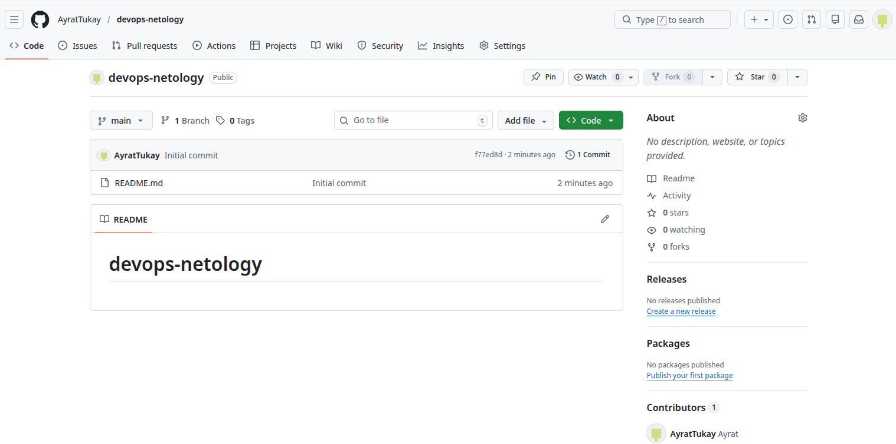 

3. Создал авторизационный токен для клонирования репозитория.  
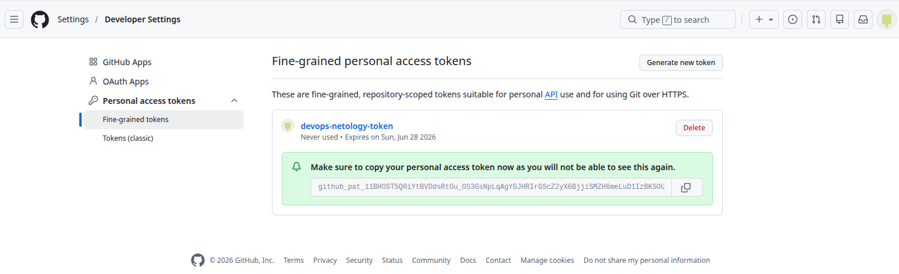  

4. Склонировал репозиторий, используя протокол HTTPS.
```
git clone https://github.com/AyratTukay/devops-netology.git
```
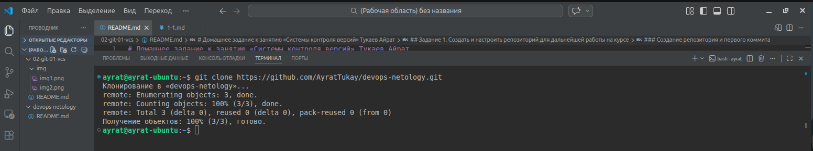  

5. Перешёл в каталог с клоном репозитория (`cd devops-netology`).

6. Произвёл первоначальную настройку Git.  
```
git config --global user.name "Ayrat Tukaev"
git config --global user.email tukay72@yandex.ru
```

7. Выполнил команду `git status`  
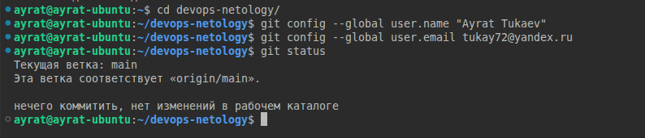

8. Отредактировал файл `README.md` с помощью редактора Nano.  

9. Повторно выполнил команду `git status`  
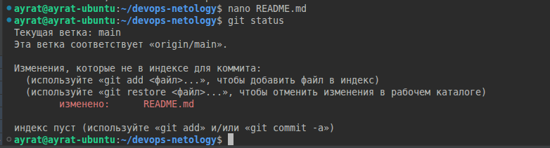

10. Выполнил команды `git diff` и `git diff --staged`.
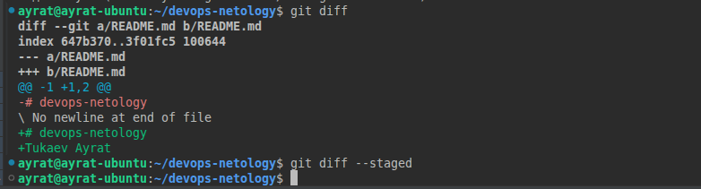

11. Перевёл файл в состояние `staged` командой `git add README.md`, т.е. проиндексировал файл README.md

12. Ещё раз выполнил команды `git diff` и `git diff --staged`. Мы видим что наш файл перешёл в категорию проиндексированных. Подготовлен для коммита.
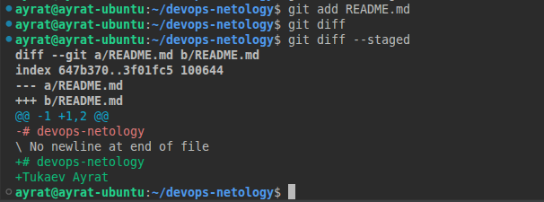

13. Выполнил коммит `git commit -m 'First commit'`.  
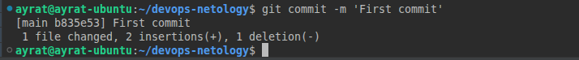

14. Выводы команд `git status`, `git diff` и `git diff --staged`. Видим что файл подготовлен для отправки в удалённый репозиторий. Непроиндексированных и индексированных файлов больше нет.    
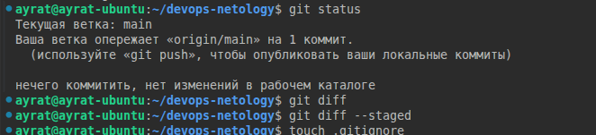

### Создание файлов `.gitignore` и второго коммита

1. Создайте файл `.gitignore` (обратите внимание на точку в начале файла), проверьте его статус сразу после создания. 
2. Добавьте файл `.gitignore` в следующий коммит (`git add...`).
3. На одном из следующих блоков вы будете изучать `Terraform`, давайте сразу создадим соотвествующий каталог `terraform` и внутри этого каталога — файл `.gitignore` по примеру: https://github.com/github/gitignore/blob/master/Terraform.gitignore.  
4. В файле `README.md` опишите своими словами, какие файлы будут проигнорированы в будущем благодаря добавленному `.gitignore`.
5. Закоммитьте все новые и изменённые файлы. Комментарий к коммиту должен быть `Added gitignore`.

**Выполнение:**  

1. Создал файл `.gitignore`, проверил его статус. Видим что появился неотслеживаемый файл.  
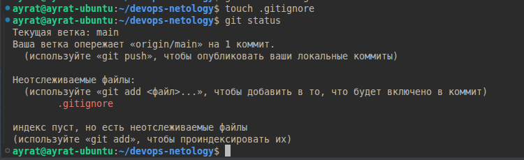

2. Добавьте файл `.gitignore` в следующий коммит.
```
git add .gitignore
```
3. Создал каталог `terraform` и внутри этого каталога — файл `.gitignore`.   
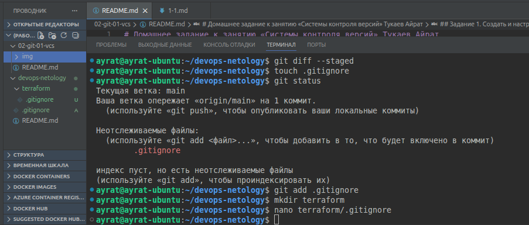

4. По предыдущему скрину видим что у нас имеются два файла .gitignore. Один в корне проекта и другой в папке terraform. Действия этих файлов распространяются только на директорию где они лежат. Действие файла в корне не распространяется на файлы внутри папки terraform.  
  Во вновь созданном файле .gitignore имеются следующие строки:
```
  .terraform/                    # данная директория будет проигнорирована
  *.tfstate                      # будет проигнорирован любой файл заканчивающийся на .tfstate
  *.tfstate.*                    # буден проигнорирован любой файл содержаший в середине .tfstate.
  crash.log                      # данный файл будет проигнорирован
  crash.*.log                    # любой файл начинающийся с crash. и заканчивающийся на .log
  *.tfvars                       # будет проигнорирован любой файл заканчивающийся на .tfvars
  *.tfvars.json                  # будет проигнорирован любой файл заканчивающийся на .tfvars.json
  override.tf                    # данный файл будет проигнорирован
  override.tf.json               # данный файл будет проигнорирован
  *_override.tf                  # будет проигнорирован любой файл заканчивающийся на _override.tf
  *_override.tf.json             # будет проигнорирован любой файл заканчивающийся на _override.tf.json
  .terraform.tfstate.lock.info   # данный файл будет проигнорирован
  .terraformrc                   # данный файл будет проигнорирован
  terraform.rc                   # данный файл будет проигнорирован
```
5. Закоммитил все новые и изменённые файлы.  
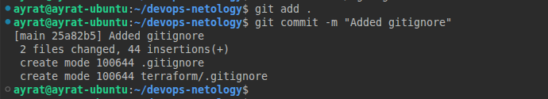


### Эксперимент с удалением и перемещением файлов (третий и четвёртый коммит)

1. Создайте файлы `will_be_deleted.txt` (с текстом `will_be_deleted`) и `will_be_moved.txt` (с текстом `will_be_moved`) и закоммите их с комментарием `Prepare to delete and move`.
2. В случае необходимости обратитесь к [официальной документации](https://git-scm.com/book/ru/v2/Основы-Git-Запись-изменений-в-репозиторий) — здесь подробно описано, как выполнить следующие шаги. 
3. Удалите файл `will_be_deleted.txt` с диска и из репозитория. 
4. Переименуйте (переместите) файл `will_be_moved.txt` на диске и в репозитории, чтобы он стал называться `has_been_moved.txt`.
5. Закоммитьте результат работы с комментарием `Moved and deleted`.

**Выполнение:**  

1. Создал файлы `will_be_deleted.txt` (с текстом `will_be_deleted`) и `will_be_moved.txt` (с текстом `will_be_moved`) и закоммитил их с комментарием `Prepare to delete and move`.  
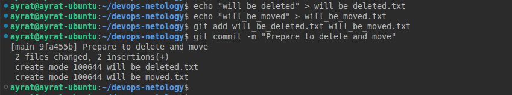

2. Удалил файл `will_be_deleted.txt` с диска и из репозитория.  
```
git rm will_be_deleted.txt
```
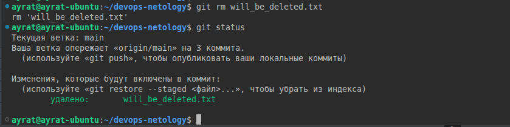

3. Переименовал (переместил) файл `will_be_moved.txt` на диске и в репозитории на `has_been_moved.txt`.  
```
git mv will_be_moved.txt has_been_moved.txt
```
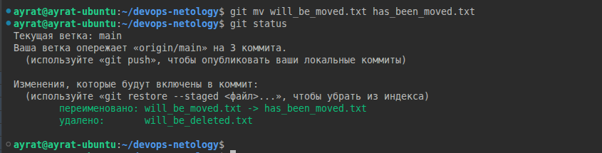

4. Закоммитил результат работы с комментарием `Moved and deleted`.  
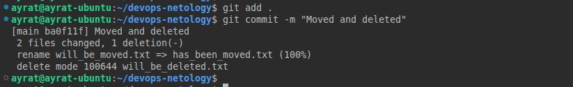


### Проверка изменения

1. В результате предыдущих шагов в репозитории должно быть как минимум пять коммитов (если вы сделали ещё промежуточные — нет проблем):
    * `Initial Commit` — созданный GitHub при инициализации репозитория. 
    * `First commit` — созданный после изменения файла `README.md`.
    * `Added gitignore` — после добавления `.gitignore`.
    * `Prepare to delete and move` — после добавления двух временных файлов.
    * `Moved and deleted` — после удаления и перемещения временных файлов. 
2. Проверьте это, используя комманду `git log`. Подробно о формате вывода этой команды мы поговорим на следующем занятии, но посмотреть, что она отображает, можно уже сейчас.

**Выполнение:**  

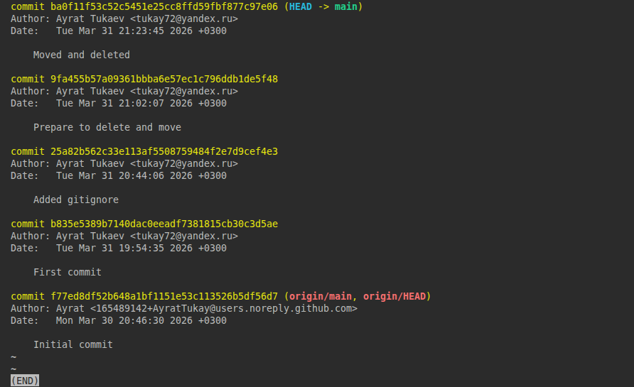

### Отправка изменений в репозиторий

Выполните команду `git push`, если Git запросит логин и пароль — введите ваши логин и пароль от GitHub. 

**Выполнение:**  

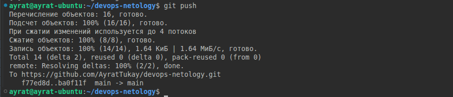

В качестве результата отправьте ссылку на репозиторий. 

----

### Правила приёма домашнего задания

В личном кабинете отправлена ссылка на ваш репозиторий.


### Критерии оценки

Зачёт:

* выполнены все задания;
* ответы даны в развёрнутой форме;
* приложены соответствующие скриншоты и файлы проекта;
* в выполненных заданиях нет противоречий и нарушения логики.

На доработку:

* задание выполнено частично или не выполнено вообще;
* в логике выполнения заданий есть противоречия и существенные недостатки. 