# Домашнее задание к занятию «Основы Git» Тукаев Айрат

------

## Задание 1. Знакомимся с GitLab и Bitbucket 

Из-за сложности доступа к Bitbucket в работе достаточно использовать два репозитория: GitHub и GitLab.

Иногда при работе с Git-репозиториями надо настроить свой локальный репозиторий так, чтобы можно было 
отправлять и принимать изменения из нескольких удалённых репозиториев. 

Это может понадобиться при работе над проектом с открытым исходным кодом, если автор проекта не даёт права на запись в основной репозиторий.

Также некоторые распределённые команды используют такой принцип работы, когда каждый разработчик имеет свой репозиторий, а в основной репозиторий пушатся только конечные результаты 
работы над задачами. 

### GitLab

Создадим аккаунт в GitLab, если у вас его ещё нет:

1. GitLab. Для [регистрации](https://gitlab.com/users/sign_up)  можно использовать аккаунт Google, GitHub и другие. 
1. После регистрации или авторизации в GitLab создайте новый проект, нажав на ссылку `Create a projet`. 
Желательно назвать также, как и в GitHub — `devops-netology` и `visibility level`, выбрать `Public`.
1. Галочку `Initialize repository with a README` лучше не ставить, чтобы не пришлось разрешать конфликты.
1. Если вы зарегистрировались при помощи аккаунта в другой системе и не указали пароль, то увидите сообщение:
`You won't be able to pull or push project code via HTTPS until you set a password on your account`. 
Тогда перейдите [по ссылке](https://gitlab.com/profile/password/edit) из этого сообщения и задайте пароль. 
Если вы уже умеете пользоваться SSH-ключами, то воспользуйтесь этой возможностью (подробнее про SSH мы поговорим в следующем учебном блоке).
1. Перейдите на страницу созданного вами репозитория, URL будет примерно такой:
https://gitlab.com/YOUR_LOGIN/devops-netology. Изучите предлагаемые варианты для начала работы в репозитории в секции
`Command line instructions`. 
1. Запомните вывод команды `git remote -v`.
1. Из-за того, что это будет наш дополнительный репозиторий, ни один вариант из перечисленных в инструкции (на странице 
вновь созданного репозитория) нам не подходит. Поэтому добавляем этот репозиторий, как дополнительный `remote`, к созданному
репозиторию в рамках предыдущего домашнего задания:
`git remote add gitlab https://gitlab.com/YOUR_LOGIN/devops-netology.git`.
1. Отправьте изменения в новый удалённый репозиторий `git push -u gitlab main`.
1. Обратите внимание, как изменился результат работы команды `git remote -v`.

#### Как изменить видимость репозитория в  GitLab — сделать его публичным 

* На верхней панели выберите «Меню» -> «Проекты» и найдите свой проект.
* На левой боковой панели выберите «Настройки» -> «Основные».
* Разверните раздел «Видимость» -> «Функции проекта» -> «Разрешения».
* Измените видимость проекта на Public.
* Нажмите «Сохранить изменения».

### Bitbucket* (задание со звёздочкой) 

Это самостоятельное задание, его выполнение необязательно.
____

Теперь необходимо проделать всё то же самое с [Bitbucket](https://bitbucket.org/). 

1. Обратите внимание, что репозиторий должен быть публичным — отключите галочку `private repository` при создании репозитория.
1. На вопрос `Include a README?` отвечайте отказом. 
1. В отличии от GitHub и GitLab в Bitbucket репозиторий должен принадлежать проекту, поэтому во время создания репозитория 
надо создать и проект, который можно назвать, например, `netology`.
1. Аналогично GitLab на странице вновь созданного проекта выберите `https`, чтобы получить ссылку, и добавьте этот репозиторий, как 
`git remote add bitbucket ...`.
1. Обратите внимание, как изменился результат работы команды `git remote -v`.

Если всё проделано правильно, то результат команды `git remote -v` должен быть следующий:

```bash
$ git remote -v
bitbucket https://andreyborue@bitbucket.org/andreyborue/devops-netology.git (fetch)
bitbucket https://andreyborue@bitbucket.org/andreyborue/devops-netology.git (push)
gitlab	  https://gitlab.com/andrey.borue/devops-netology.git (fetch)
gitlab	  https://gitlab.com/andrey.borue/devops-netology.git (push)
origin	  https://github.com/andrey-borue/devops-netology.git (fetch)
origin	  https://github.com/andrey-borue/devops-netology.git (push)
```

Дополнительно можете добавить удалённые репозитории по `ssh`, тогда результат будет примерно такой:

```bash
git remote -v
bitbucket	git@bitbucket.org:andreyborue/devops-netology.git (fetch)
bitbucket	git@bitbucket.org:andreyborue/devops-netology.git (push)
bitbucket-https	https://andreyborue@bitbucket.org/andreyborue/devops-netology.git (fetch)
bitbucket-https	https://andreyborue@bitbucket.org/andreyborue/devops-netology.git (push)
gitlab	git@gitlab.com:andrey.borue/devops-netology.git (fetch)
gitlab	git@gitlab.com:andrey.borue/devops-netology.git (push)
gitlab-https	https://gitlab.com/andrey.borue/devops-netology.git (fetch)
gitlab-https	https://gitlab.com/andrey.borue/devops-netology.git (push)
origin	git@github.com:andrey-borue/devops-netology.git (fetch)
origin	git@github.com:andrey-borue/devops-netology.git (push)
origin-https	https://github.com/andrey-borue/devops-netology.git (fetch)
origin-https	https://github.com/andrey-borue/devops-netology.git (push)
```

Выполните push локальной ветки `main` в новые репозитории. 

Подсказка: `git push -u gitlab main`. На этом этапе история коммитов во всех трёх репозиториях должна совпадать. 

**Решение:**  

1. К сожалению не удалось зарегистрироваться в GitLab. Не принимает данные российских карт.  

2. Зарегистрировался в Bitbucket, используя VPN. 

3. Создал публичный проект netology и репозиторий devops-netology. Согласоно условиям задания файлы README.md и .gitignore не были созданы автоматический.     
   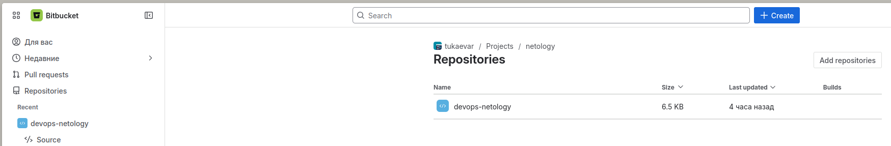

  Результат выполнения команды `git remote -v`:  
   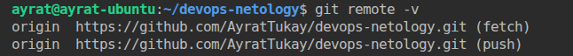 

  Добавил вновь созданный репозиторий, как `git remote add bitbucket https://ayrattukaev-admin@bitbucket.org/tukaevar/devops-netology.git`. Ещё раз проверил работу команды `git remote -v`:  
   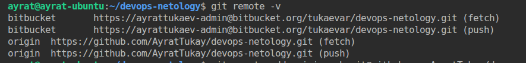 

  Дополнительно добавил удалённые репозиторий по `ssh`.  
   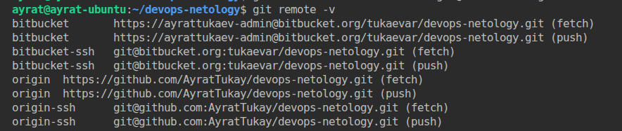 

  Выполните push локальной ветки `main` в новые репозитории. В итоге история коммитов на обеих репозиториях совпадает.  
   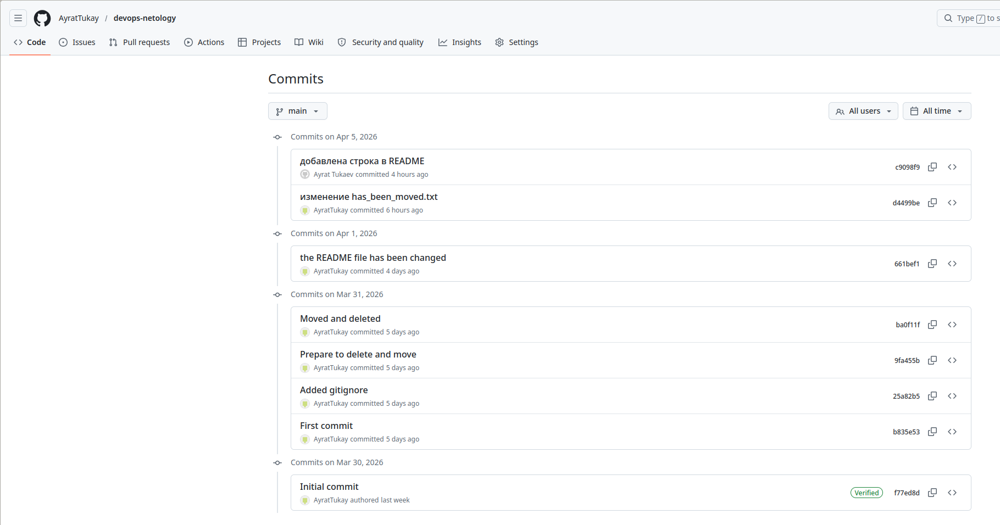   
   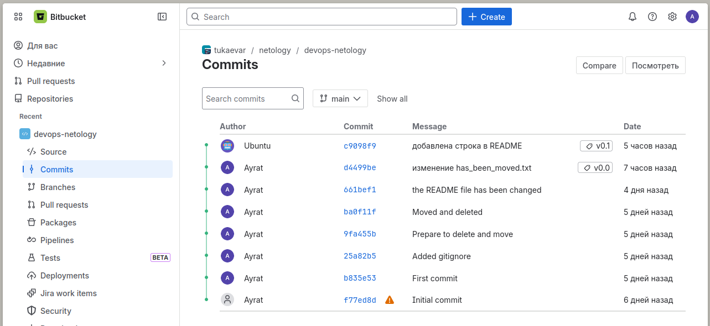   

## Задание 2. Теги

Представьте ситуацию, когда в коде была обнаружена ошибка — надо вернуться на предыдущую версию кода,
исправить её и выложить исправленный код в продакшн. Мы никуда не будем выкладывать код, но пометим некоторые коммиты тегами и создадим от них ветки. 

1. Создайте легковестный тег `v0.0` на HEAD-коммите и запуште его во все три добавленных на предыдущем этапе `upstream`.
2. Аналогично создайте аннотированный тег `v0.1`.
3. Перейдите на страницу просмотра тегов в GitHab (и в других репозиториях) и посмотрите, чем отличаются созданные теги. 
    * в GitHub — https://github.com/YOUR_ACCOUNT/devops-netology/releases;
    * в GitLab — https://gitlab.com/YOUR_ACCOUNT/devops-netology/-/tags;
    * в Bitbucket — список тегов расположен в выпадающем меню веток на отдельной вкладке. 

**Решение:**  
1. Просмотрел историю с помощью команды `git log --oneline`. 
   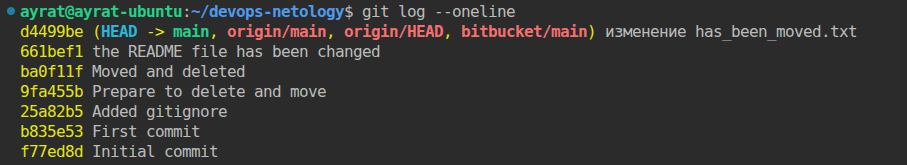 
 
   Создал легковестный тег `v0.0` на HEAD-коммите командой `git tag v0.0 d4499be` и проверил выполнение.  
   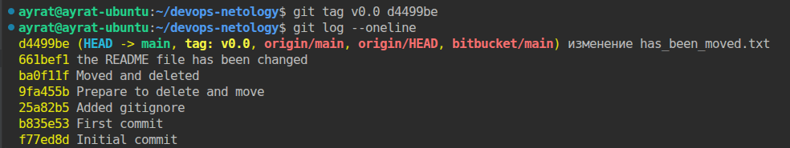 

2. Внёс изменения в файл README. Закоммитил и запушил на оба репозитория.Создал аннотированный тег `v0.1` на новом HEAD-коммите командой `git tag -a v0.1 c9098f9`, проверил изменения.  
   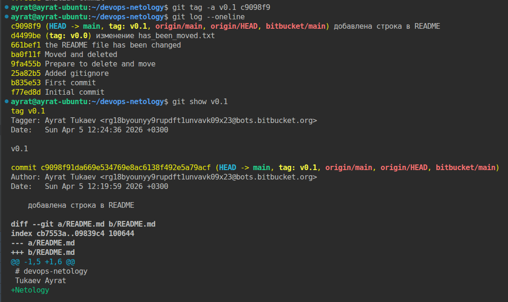 

  Запушил теги в удалённые репозиторий.  
   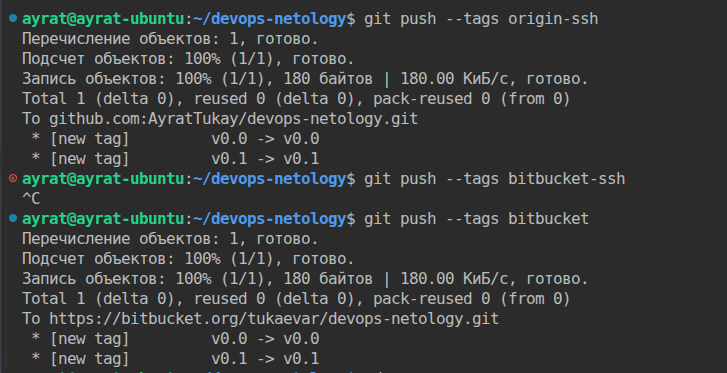 

3. Проверил теги в удалённых репозиториях.  
   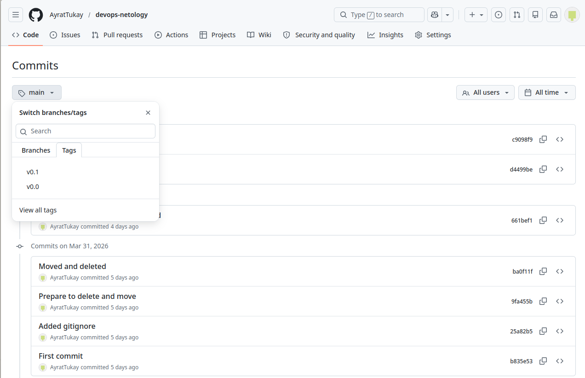  
   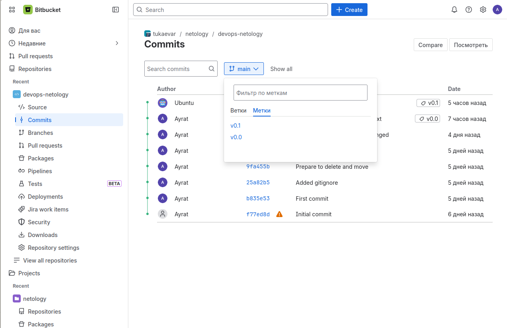 


## Задание 3. Ветки 

Давайте посмотрим, как будет выглядеть история коммитов при создании веток. 

1. Переключитесь обратно на ветку `main`, которая должна быть связана с веткой `main` репозитория на `github`.
2. Посмотрите лог коммитов и найдите хеш коммита с названием `Prepare to delete and move`, который был создан в пределах предыдущего домашнего задания. 
3. Выполните `git checkout` по хешу найденного коммита. 
4. Создайте новую ветку `fix`, базируясь на этом коммите `git switch -c fix`.
5. Отправьте новую ветку в репозиторий на GitHub `git push -u origin fix`.
6. Посмотрите, как визуально выглядит ваша схема коммитов: https://github.com/YOUR_ACCOUNT/devops-netology/network. 
7. Теперь измените содержание файла `README.md`, добавив новую строчку.
8. Отправьте изменения в репозиторий и посмотрите, как изменится схема на странице https://github.com/YOUR_ACCOUNT/devops-netology/network 
и как изменится вывод команды `git log`.

**Решение:**  

1. Пока мы никаких веток в репозиторий не создавали. По умолчанию у нас ветка `main`. Проверяем командой `git branch`.
2. Посмотрел лог коммитов и нашёл хеш коммита с названием `Prepare to delete and move`, который был создан в пределах предыдущего домашнего задания.  
   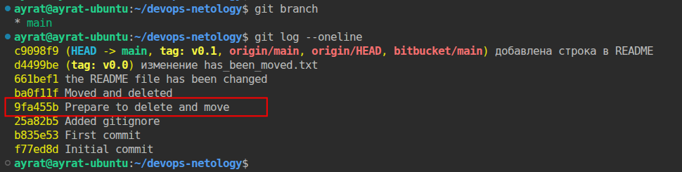 

3. Выполнил `git checkout 9fa455b` по хешу найденного коммита. Гид предупреждает что мы переместили указатель HEAD. Подсказывает какие действия мы можем выполнить.  
   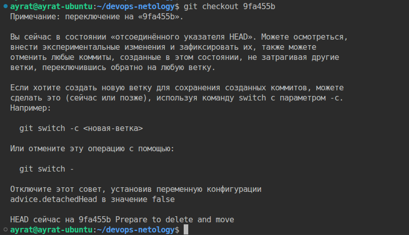  
   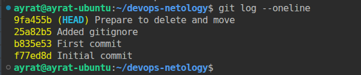  

4. Создал новую ветку `fix`, базируясь на этом коммите `git switch -c fix`. Автоматический переключились на данную ветку.  
     

5. Отправил новую ветку в репозиторий на GitHub `git push -u origin fix`.  
   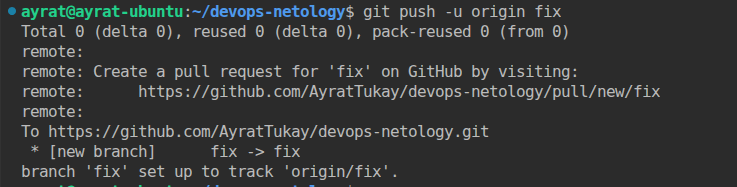 

6. Так в текущий момент визуально выглядит схема коммитов. Визуально видно что коммит в новой ветке отстаёт от коммита на основной ветке.    
   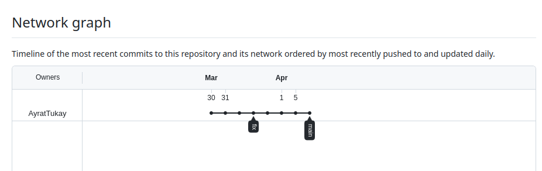 

7. Изменил содержание файла `README.md`, добавив новую строчку. Отправил изменения в репозиторий.   
   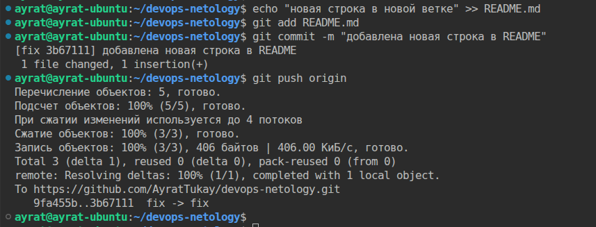 

8. Измения схемы на странице репозитория. Скрин вывода команды `git log`. Команда указывает что мы находимся в репозиторий origin в ветке fix. Появился новый коммит с хэшом 3b67111. Но в GitHub https://github.com/AyratTukay/devops-netology/network почему то отсутствуют изменения.     
   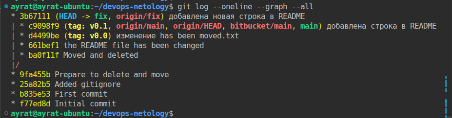   
   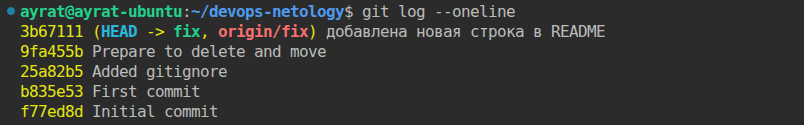 

## Задание 4. Упрощаем себе жизнь

Попробуем поработь с Git при помощи визуального редактора. 

1. В используемой IDE PyCharm откройте визуальный редактор работы с Git, находящийся в меню View -> Tool Windows -> Git.
1. Измените какой-нибудь файл, и он сразу появится на вкладке `Local Changes`, отсюда можно выполнить коммит, нажав на кнопку внизу этого диалога. 
1. Элементы управления для работы с Git будут выглядеть примерно так:

   
   
1. Попробуйте выполнить пару коммитов, используя IDE. 

[По ссылке](https://www.jetbrains.com/help/pycharm/commit-and-push-changes.html) можно найти справочную информацию по визуальному интерфейсу. 

Если вверху экрана выбрать свою операционную систему, можно посмотреть горячие клавиши для работы с Git. 
Подробней о визуальном интерфейсе мы расскажем на одной из следующих лекций.

**Решение:**  
Из-за блокировки PyCharm в Россий работаю в Visual Studio Code. Внёс изменения в файл README.md. 
   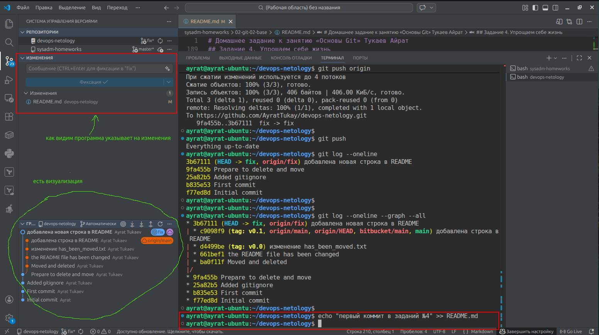 

Закоммитил и отправил изменения в удалённый репозиторий.  
   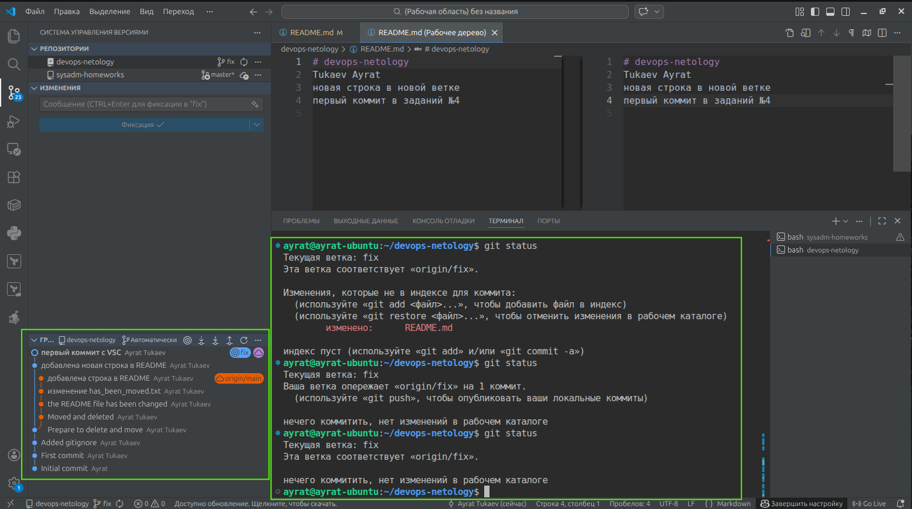 

Внёс ещё изменения, создал второй коммит и отправил в удалённый репозиторий.  
   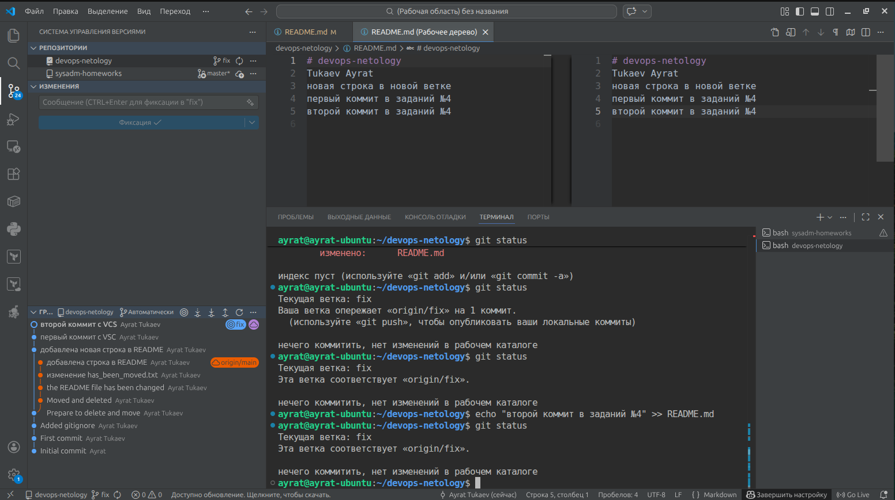 

*В качестве результата работы по всем заданиям приложите ссылки на ваши репозитории в GitHub, GitLab и Bitbucket*.  
 
Ссылки на мои репозитории:
[GitHub](https://github.com/AyratTukay/devops-netology)
[Bitbucket](https://bitbucket.org/tukaevar/devops-netology/src/main/)

----

### Правила приёма домашнего задания

В личном кабинете отправлены ссылки на ваши репозитории.


### Критерии оценки

Зачёт:

* выполнены все задания;
* ответы даны в развёрнутой форме;
* приложены соответствующие скриншоты и файлы проекта;
* в выполненных заданиях нет противоречий и нарушения логики.

На доработку:

* задание выполнено частично или не выполнено вообще;
* в логике выполнения заданий есть противоречия и существенные недостатки.  
 
Обязательными являются задачи без звёздочки. Их выполнение необходимо для получения зачёта и диплома о профессиональной переподготовке.

Задачи со звёздочкой (*) являются дополнительными или задачами повышенной сложности. Они необязательные, но их выполнение поможет лучше разобраться в теме.
