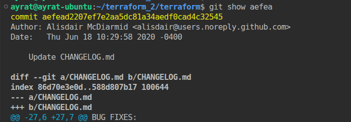
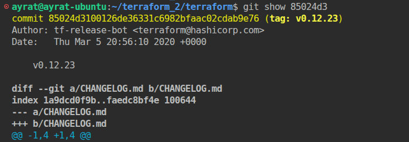
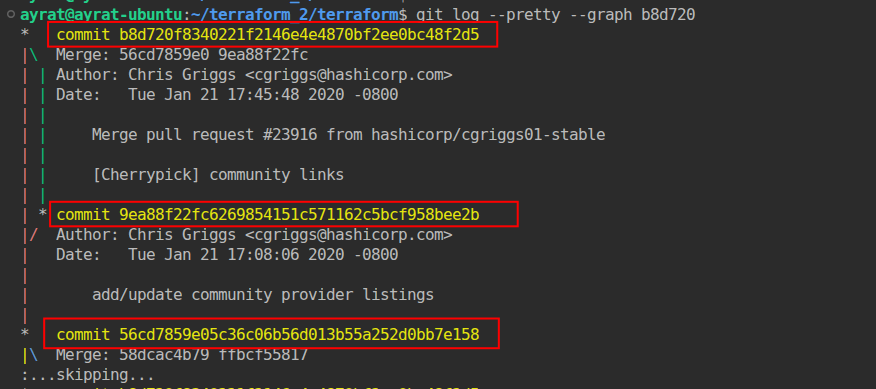
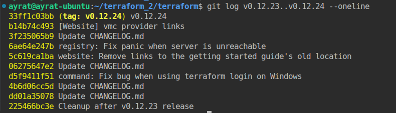
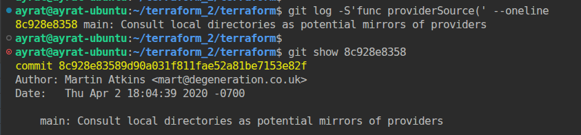
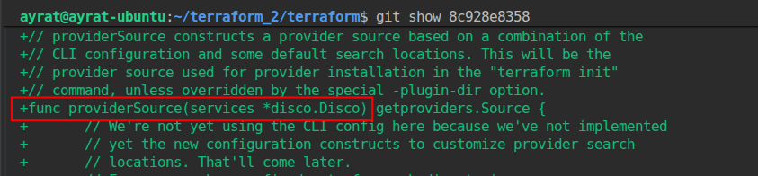
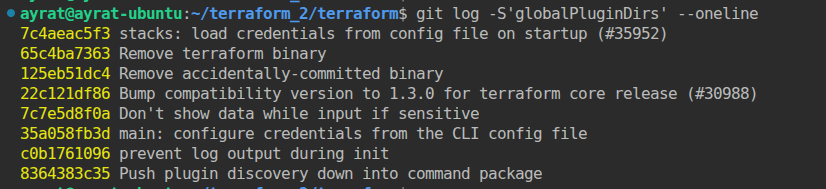
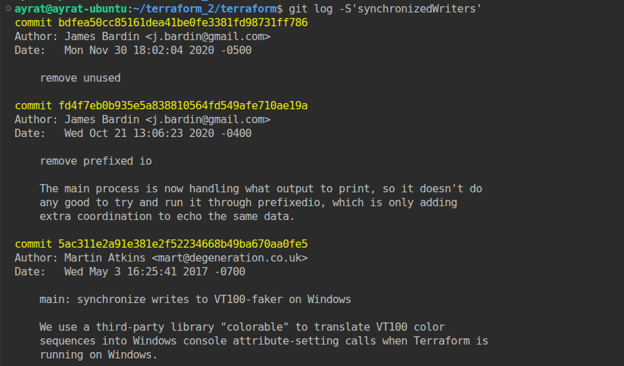
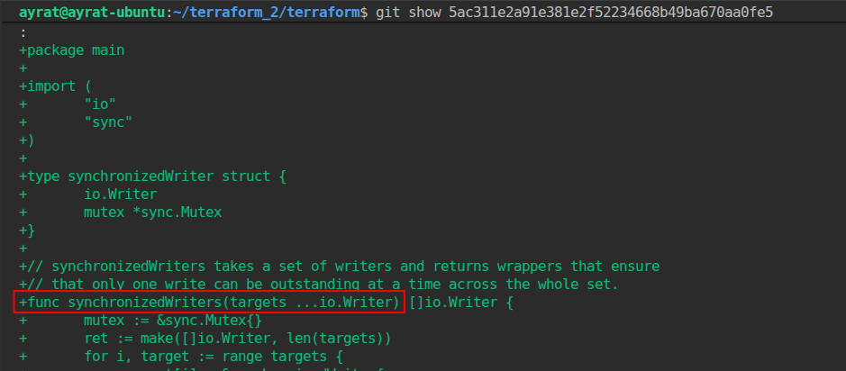

# Домашнее задание к занятию «Инструменты Git» Тукаев Айрат

### Цель задания

В результате выполнения задания вы:

* научитесь работать с утилитами Git;
* потренируетесь решать типовые задачи, возникающие при работе в команде. 

### Инструкция к заданию

1. Склонируйте [репозиторий](https://github.com/hashicorp/terraform) с исходным кодом Terraform.
2. Создайте файл для ответов на задания в своём репозитории, после выполнения прикрепите ссылку на .md-файл с ответами в личном кабинете.
3. Любые вопросы по решению задач задавайте в разделе "Вопросы по заданию".

------

## Задание

В клонированном репозитории:

1. Найдите полный хеш и комментарий коммита, хеш которого начинается на `aefea`.
2. Ответьте на вопросы.

* Какому тегу соответствует коммит `85024d3`?
* Сколько родителей у коммита `b8d720`? Напишите их хеши.
* Перечислите хеши и комментарии всех коммитов, которые были сделаны между тегами  v0.12.23 и v0.12.24.
* Найдите коммит, в котором была создана функция `func providerSource`, её определение в коде выглядит так: `func providerSource(...)` (вместо троеточия перечислены аргументы).
* Найдите все коммиты, в которых была изменена функция `globalPluginDirs`.
* Кто автор функции `synchronizedWriters`? 

*В качестве решения ответьте на вопросы и опишите, как были получены эти ответы.*

## Решение:  
1. Найдите полный хеш и комментарий коммита, хеш которого начинается на `aefea`.  
Полный хеш коммита: `efead2207ef7e2aa5dc81a34aedf0cad4c32545`.  
Автор Alisdair McDiarmid написал коммит: `Update CHANGELOG.md`. Использована команда `git show aefea`.   
    

2. Ответьте на вопросы.

* Какому тегу соответствует коммит `85024d3`?  
 Коммиту соответствует тег `v0.12.23`. Использована команда `git show 85024d3`. 
    

* Сколько родителей у коммита `b8d720`? Напишите их хеши.  
 У коммита `b8d720` два родителя хешами `9ea88f22fc6269854151c571162c5bcf958bee2b` и `56cd7859e05c36c06b56d013b55a252d0bb7e158`. Использовал команду `git log --pretty --graph b8d720` 
    

* Перечислите хеши и комментарии всех коммитов, которые были сделаны между тегами  v0.12.23 и v0.12.24.  
 Для определения использовал команду `git log v0.12.23..v0.12.24 --oneline`.  
    

* Найдите коммит, в котором была создана функция `func providerSource`, её определение в коде выглядит так: `func providerSource(...)` (вместо троеточия перечислены аргументы).  
 Использовал команду `git log -S'func providerSource(' --oneline`. Далее чтоб убедиться что всё правильно определено посмотрел какие измения были внесены при этом коммите командой `git show 8c928e8358`.  
    
    

* Найдите все коммиты, в которых была изменена функция `globalPluginDirs`.  
 Использовал команду `git log -S'globalPluginDirs' --oneline`.  
   

* Кто автор функции `synchronizedWriters`?  
 С помощью команды `git log -S'synchronizedWriters'` нашёл коммиты. Командой `git show 5ac311e2a91e381e2f52234668b49ba670aa0fe5` просмотрел самый первый коммит чтоб убедится что именно там была добавлена эта функция. Его автор Martin Atkins.  
   
   

---

### Правила приёма домашнего задания

В личном кабинете отправлена ссылка на .md-файл в вашем репозитории.

### Критерии оценки

Зачёт:

* выполнены все задания;
* ответы даны в развёрнутой форме;
* приложены соответствующие скриншоты и файлы проекта;
* в выполненных заданиях нет противоречий и нарушения логики.

На доработку:

* задание выполнено частично или не выполнено вообще;
* в логике выполнения заданий есть противоречия и существенные недостатки.
